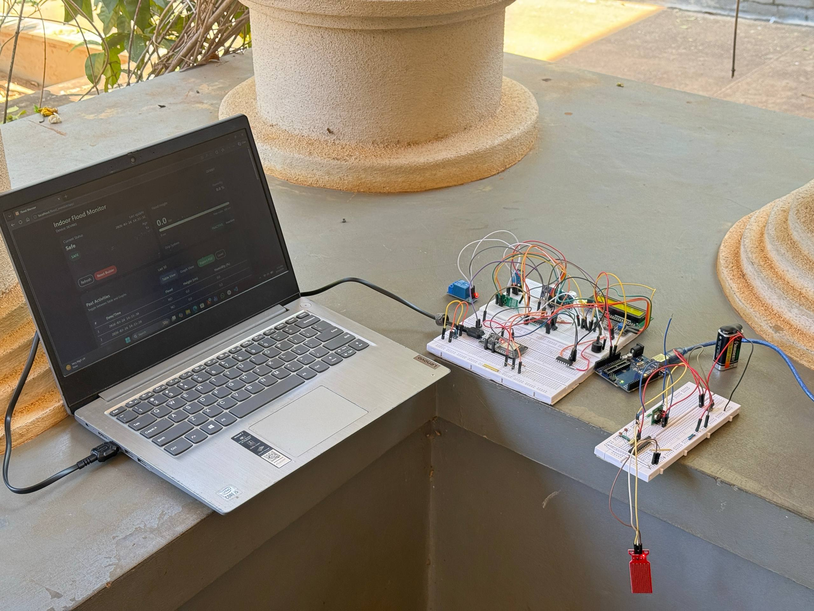
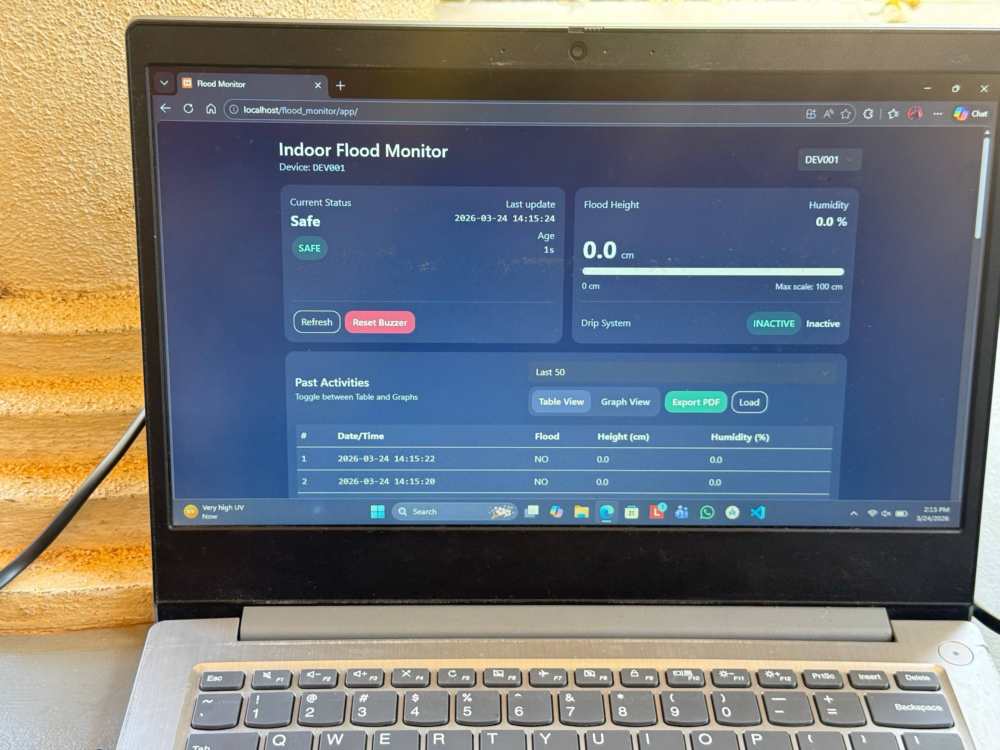

# Wireless Flood Detection and Environmental Monitoring System

## Overview

This project is a wireless flood detection and environmental monitoring system designed to provide early warnings during water-related incidents. The system consists of a transmitter unit and a receiver unit communicating through 433 MHz RF modules.

When water is detected at the transmitter side, an alert is sent wirelessly to the receiver. The receiver activates visual and audible alarms while monitoring water depth, temperature, and humidity. All information is displayed on an LCD and an ESP32-based user interface.

## Features

- Wireless water detection
- 433 MHz RF communication
- Real-time alarm system
- Water depth measurement
- Temperature monitoring
- Humidity monitoring
- LCD display
- ESP32 dashboard interface
- Buzzer mute functionality
- Low-power battery operation

## Hardware Components

### Transmitter Unit
- ATmega328P
- Water Sensor
- RF 433 MHz Transmitter
- LED
- Battery

### Receiver Unit
- ATmega328P
- RF 433 MHz Receiver
- ESP32
- Ultrasonic Sensor
- DHT11 Sensor
- 16x2 LCD
- LEDs
- Buzzer
- Push Button
- Logic IC
- Battery

## Working Principle

1. Water sensor detects water presence.
2. ATmega328 transmits an alert using the RF transmitter.
3. Receiver obtains the signal through the RF receiver.
4. LEDs and buzzer are activated.
5. Ultrasonic sensor measures water depth.
6. DHT11 measures temperature and humidity.
7. ESP32 displays all readings on the user interface.
8. Users can mute the buzzer using a push button.
9. Alarm can be reset through the interface.

## Software Requirements

- Arduino IDE
- ESP32 Board Package
- RF Communication Library
- DHT11 Library
- LiquidCrystal Library

## Applications

- Flood monitoring
- River monitoring
- Drainage monitoring
- Water tank overflow detection
- Smart disaster management
- Remote environmental monitoring

## Future Improvements

- LoRa communication
- GSM/SMS alerts
- Cloud integration
- Mobile application
- AI-based flood prediction

## System Overview

## Transmitter Unit and Reciver unit

## Interface
